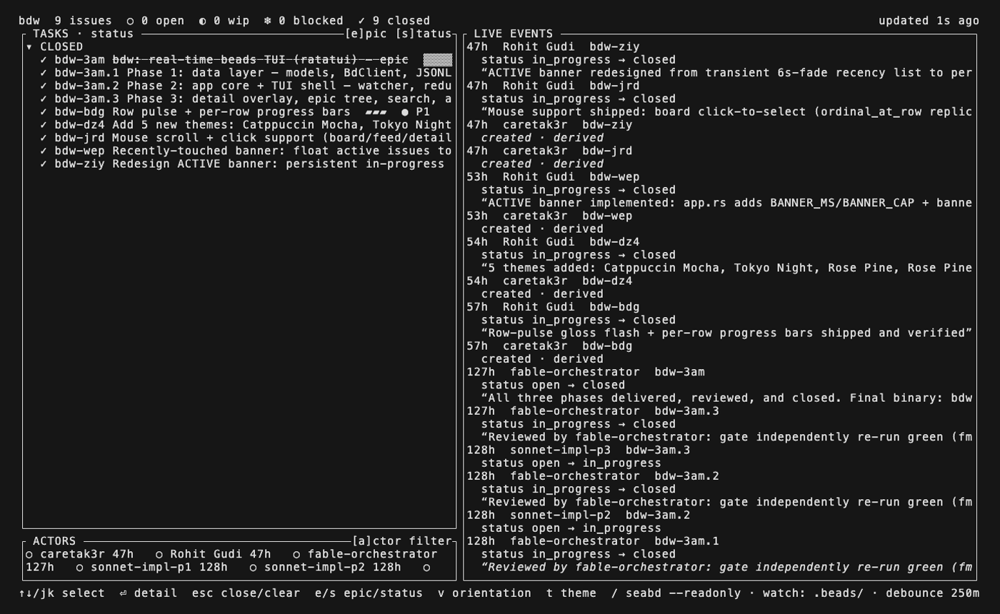
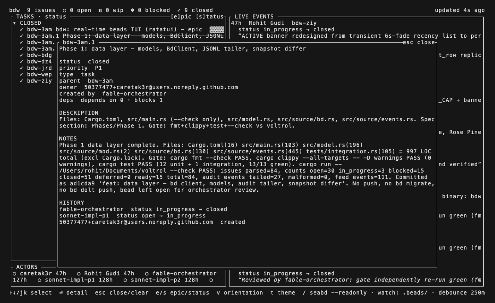
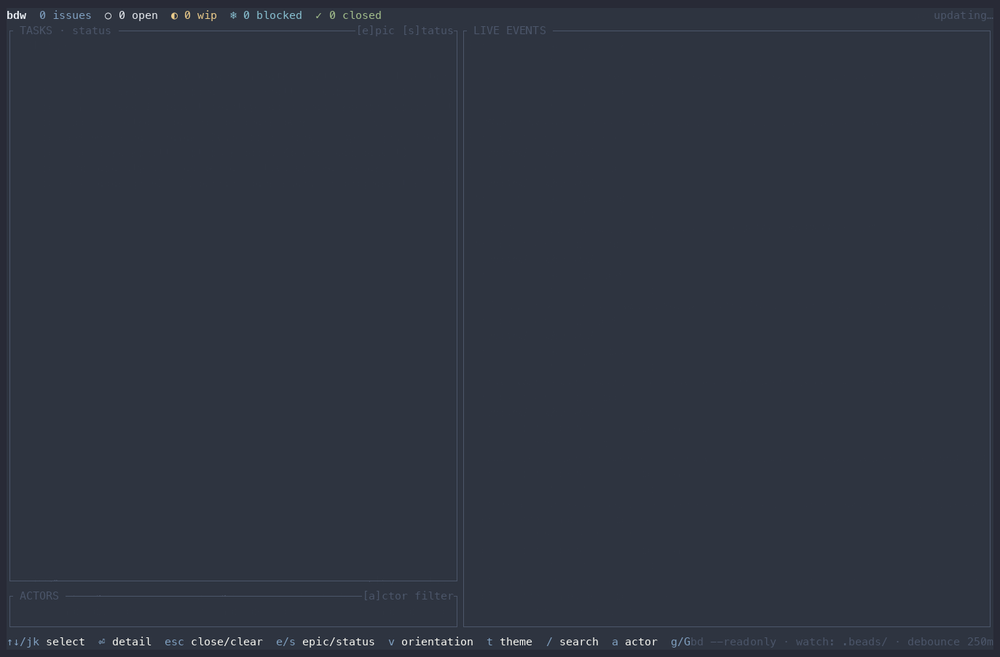
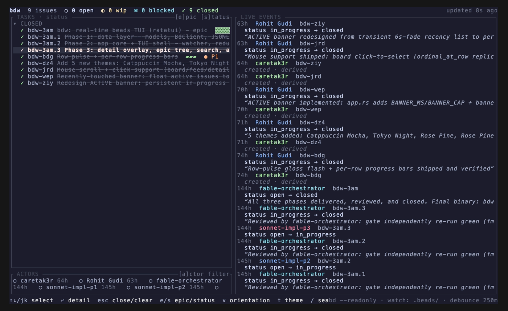
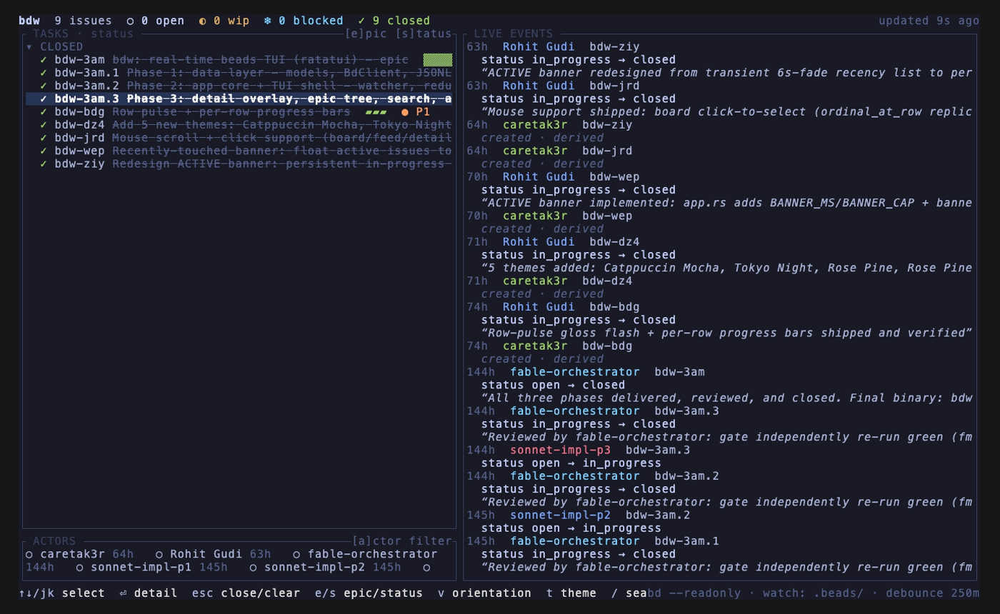
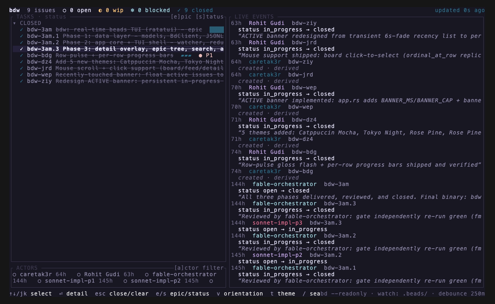
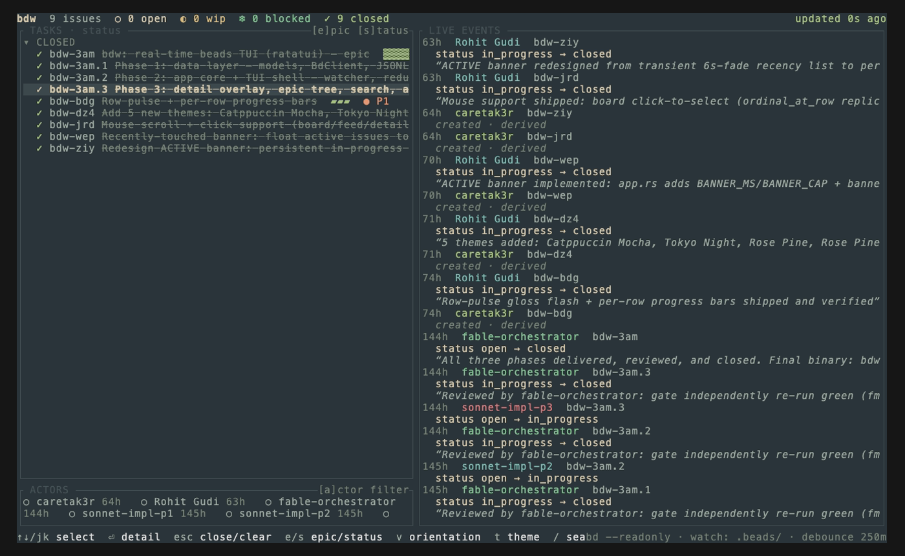
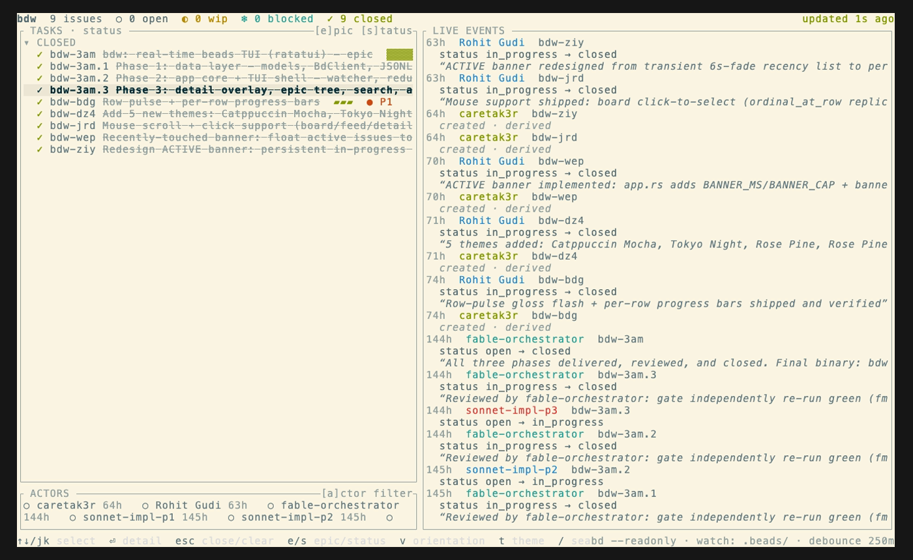
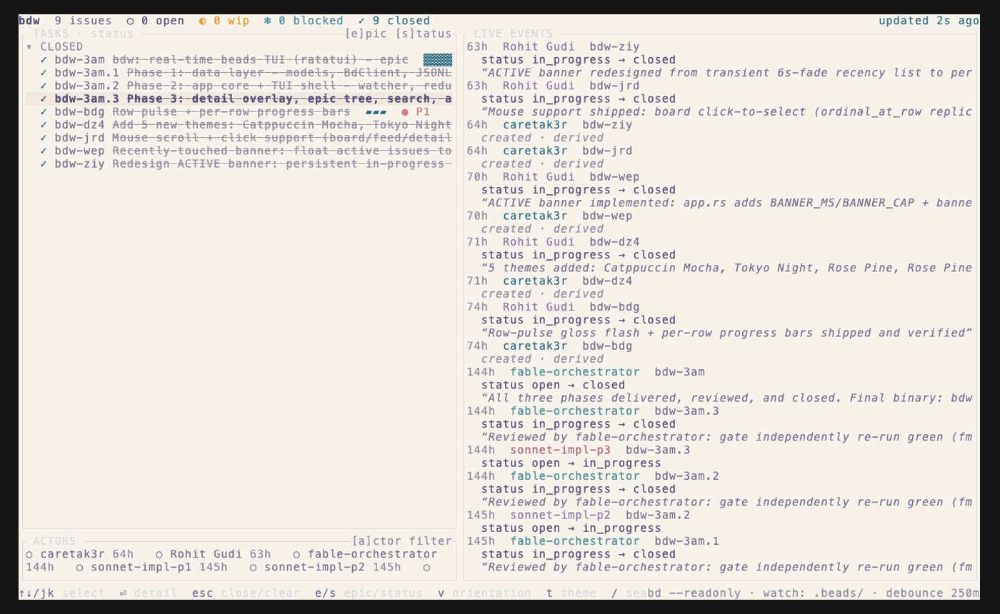

# bdw

A real-time terminal dashboard for [beads (`bd`)](https://github.com/gastownhall/beads) task-tracking projects. Point it at a `bd` project and get a live board of your issues plus a scrolling feed of audit events — no polling, no manual refresh.

[](https://github.com/caretak3r/bdw/actions/workflows/ci.yml)
[](https://github.com/caretak3r/bdw/actions/workflows/release-plz.yml)
[](https://github.com/caretak3r/bdw/releases/latest)
[](LICENSE)

## Why

`bd status`/`bd list` are point-in-time snapshots. `bdw` watches `.beads/` for changes (file events, debounced 250ms) and re-renders automatically, so a task board stays open on a second monitor and reflects work as agents or teammates close and create issues.

## Screenshots

Grouped by status, with per-row progress bars and a live actor strip:



Grouped by epic, showing the task tree:


Issue detail overlay with Markdown-rendered description/notes/history:



Full interaction (grouping toggle, detail overlay, live events feed):


Orientation toggle (`v`) and drag-to-resize pane splits:



### Themes

`t` cycles through nine terminal-familiar palettes, persisted to `~/.config/bdw/theme`:

| | | |
| --- | --- | --- |
| Catppuccin Mocha | Tokyo Night | Rosé Pine |
|  |  |  |
| Everforest | Solarized Light | Rosé Pine Dawn |
|  |  |  |


## Features

- **Live updates** — watches `.beads/` via `notify`, debounces bursts, and never invokes `bd` more than once a second.
- **Two groupings** — by status (`s`) or by epic tree (`e`).
- **Markdown-rendered detail overlay** (`⏎`) — description, notes, and history render headings, emphasis, lists, blockquotes, tables, and fenced code blocks.
- **Live events feed** — a scrolling audit trail (`bd`'s JSONL event log), diffed against snapshots so status transitions show up immediately.
- **Actor strip** — every actor touching the project, with an `[a]` filter and recency-weighted activity.
- **Incremental search** (`/`), actor filter cycling, top/bottom jumps (`g`/`G`), mouse scroll and click-to-select.
- **Nine terminal-familiar themes** (`t` to cycle) — Nord, Gruvbox, Dracula, Catppuccin Mocha, Tokyo Night, Rosé Pine (+ Dawn), Everforest, Solarized Light — persisted to `~/.config/bdw/theme`.
- **`--check` mode** — one refresh, print a summary, exit; useful for scripting or CI smoke tests.

## Install

Prebuilt binaries (Linux x86_64, macOS arm64, macOS x86_64) are attached to every [release](https://github.com/caretak3r/bdw/releases):

```bash
curl -L https://github.com/caretak3r/bdw/releases/latest/download/bdw-$(curl -sL https://api.github.com/repos/caretak3r/bdw/releases/latest | grep -o '"tag_name": *"[^"]*"' | cut -d'"' -f4)-$(uname -m | sed 's/arm64/aarch64/')-$([ "$(uname)" = "Darwin" ] && echo apple-darwin || echo unknown-linux-gnu).tar.gz | tar xz
```

Or build from source (requires a recent stable Rust toolchain):

```bash
cargo install --path . --locked
```

## Usage

```bash
bdw [PATH]        # launch the dashboard; PATH defaults to the current directory
bdw --check       # one refresh, print a summary, exit non-interactively
```

`bdw` walks up from `PATH` looking for a `.beads/` directory, same discovery rule as `bd` itself.

### Keybindings

| Key | Action |
| --- | --- |
| `↑↓` / `j` `k` | Move selection |
| `⏎` | Open issue detail |
| `esc` | Close overlay / clear filters |
| `e` / `s` | Group by epic / status |
| `t` | Cycle theme |
| `v` | Toggle pane orientation |
| `/` | Incremental search |
| `a` | Cycle actor filter |
| `g` / `G` | Jump to top / bottom |
| `q` | Quit |

## Development

```bash
cargo fmt --all --check
cargo clippy --all-targets --all-features -- -D warnings
cargo test --all-targets
```

The integration test spawns a real `bd init`/`bd create` project when `bd` is on `PATH`, and skips (not fails) otherwise.

This project dogfoods itself — its own `.beads/` directory is a real `bd` project, tracked with `bdw`.

## Release process

Releases are fully automatic (see [`.github/workflows/release-plz.yml`](.github/workflows/release-plz.yml)):

1. Every push to `main` is built and tested across Linux and macOS (`ci.yml`).
2. When that CI run succeeds on `main`, a `workflow_run`-triggered job (`release-plz.yml`) runs [`release-plz`](https://release-plz.dev), which inspects commits since the last release. If any are semver-relevant ([Conventional Commits](https://www.conventionalcommits.org/)), it commits a `Cargo.toml`/`CHANGELOG.md` bump straight to `main` and cuts the git tag and GitHub Release in the same run.
3. The new tag triggers `build-binaries`, which cross-compiles and attaches prebuilt binaries to the release.

No manual `git tag` or release step is ever required. `fix:` commits bump patch, `feat:` bumps minor, `feat!:`/`BREAKING CHANGE:` bumps major.

## License

[MIT](LICENSE)
